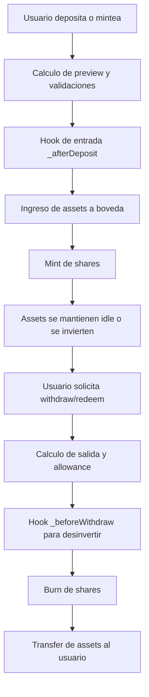
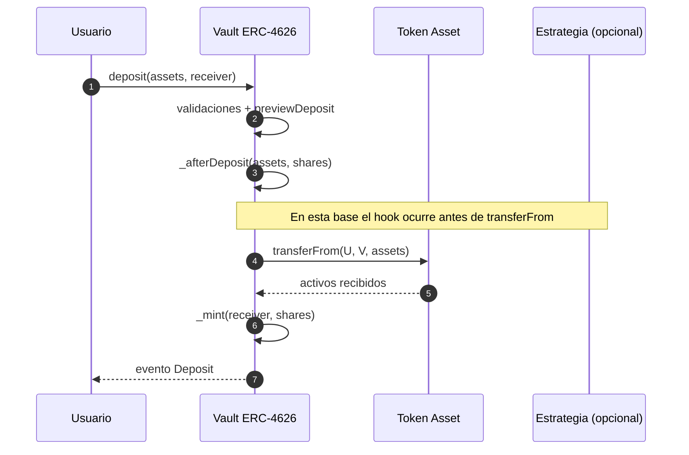
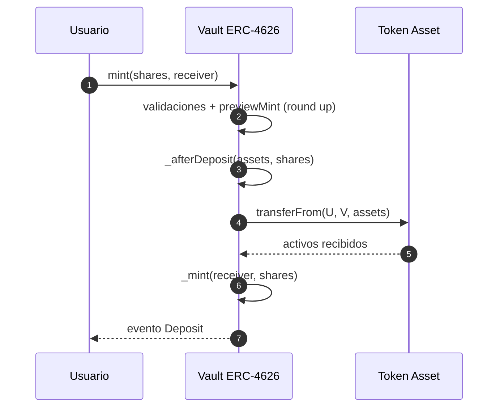
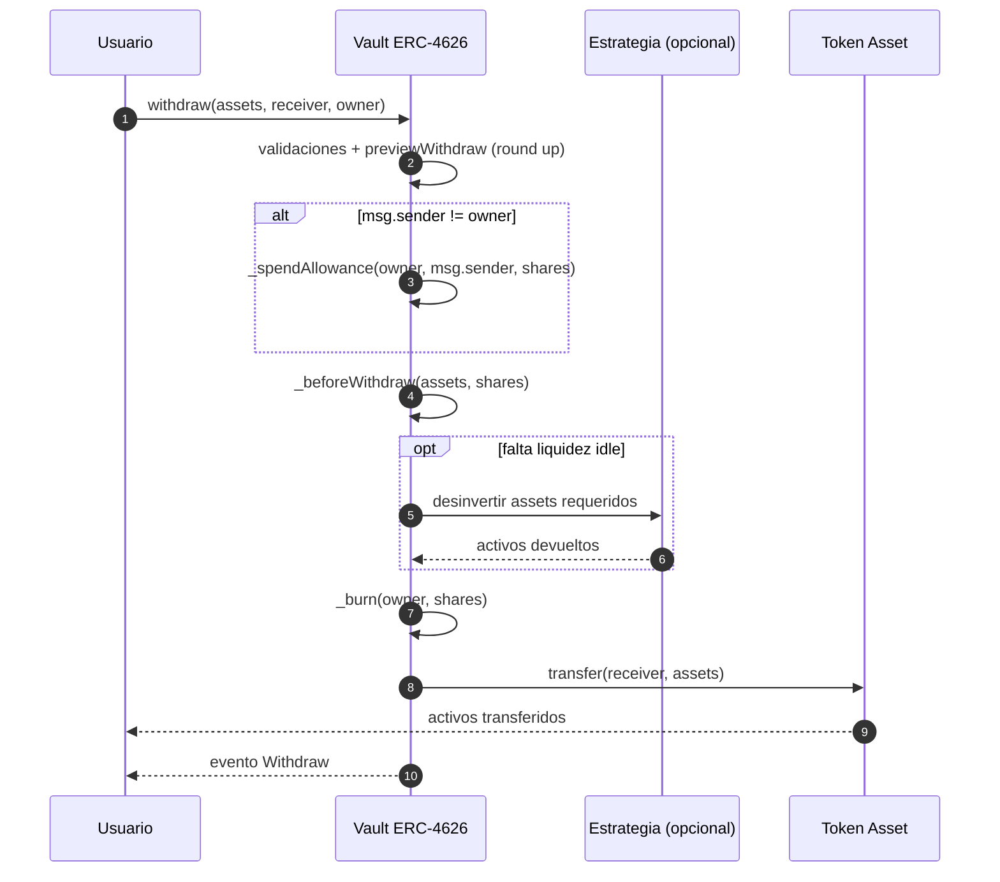
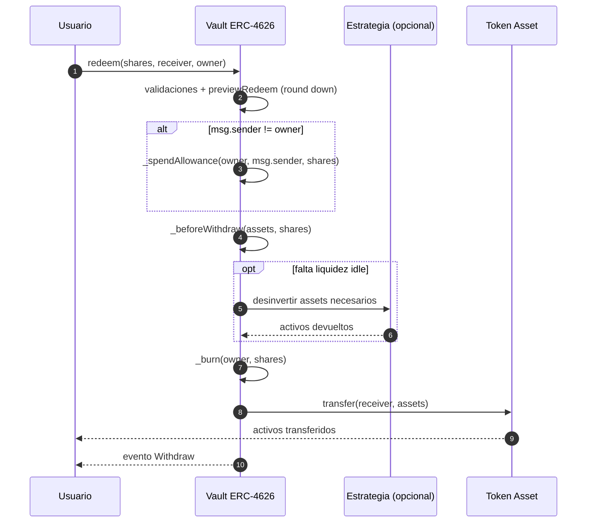
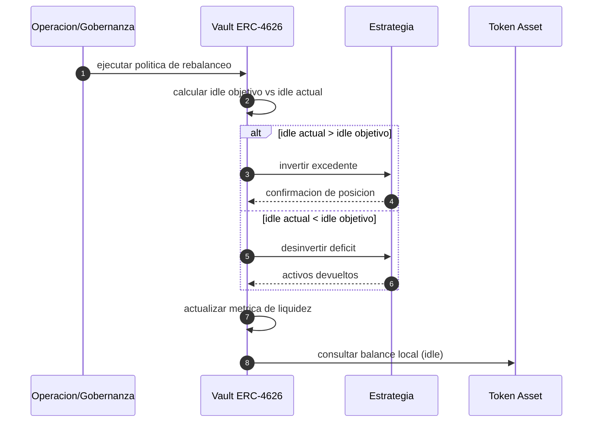

# Arquitectura y Flujos del Contrato ERC-4626

Este documento describe la arquitectura funcional del contrato base ERC-4626 y sus flujos operativos principales.

## 1) Objetivo del contrato

El contrato ERC-4626 modela una boveda tokenizada donde:
- Los usuarios depositan un activo subyacente (asset).
- Reciben shares ERC-20 que representan una participacion proporcional.
- Pueden retirar/redimir segun el valor actualizado de la boveda.

## 2) Componentes de arquitectura

### 2.1 Capa de activo subyacente
- `assetToken`: token ERC-20 subyacente.
- `asset()`: expone la direccion del token asset.

Responsabilidad:
- Custodiar liquidez idle.
- Transferir activos en entradas y salidas.

### 2.2 Capa de shares ERC-20
- `totalSupply`, `balanceOf`, `allowance`.
- `approve`, `transfer`, `transferFrom`.
- Internas: `_mint`, `_burn`, `_transfer`, `_spendAllowance`.

Responsabilidad:
- Representar propiedad proporcional de la boveda.
- Habilitar composabilidad ERC-20.

### 2.3 Capa de valuacion
- `totalAssets()` (virtual): define el valor economico total de la boveda.
- Conversiones:
  - `convertToShares`, `convertToAssets`
  - `previewDeposit`, `previewMint`, `previewWithdraw`, `previewRedeem`

Responsabilidad:
- Transformar activos <-> shares con reglas de redondeo coherentes.
- Exponer estimaciones previas para UX e integraciones.

### 2.4 Capa de estrategia (hooks)
- `_afterDeposit(assets, shares)`.
- `_beforeWithdraw(assets, shares)`.

Responsabilidad:
- Integrar despliegue de capital a estrategias externas.
- Traer liquidez para retiros antes de transferir al usuario.

## 3) Principios contables

La valuacion correcta debe considerar activos locales y activos invertidos:

$$
totalAssets = idle + invested + accruedYield - losses - fees
$$

Donde:
- `idle`: activo disponible en la direccion de la boveda.
- `invested`: activo desplegado en estrategia externa.
- `accruedYield`: rendimiento acumulado.
- `losses` y `fees`: ajustes de perdida y comisiones.

## 4) Flujos operativos principales

### 4.1 Flujo de entrada por `deposit`

Objetivo:
- Usuario define `assets` y recibe shares calculadas.

Pasos:
1. Validaciones (`receiver`, `assets`, `maxDeposit`).
2. Calcula `shares = previewDeposit(assets)`.
3. Ejecuta `_afterDeposit(assets, shares)`.
4. Ejecuta `transferFrom` de asset hacia la boveda.
5. Acuna shares al `receiver`.
6. Emite evento `Deposit`.

Nota tecnica:
- En esta base, el hook `_afterDeposit` ocurre antes de `transferFrom`.
- Si se invierte inmediatamente en el hook, no debe asumirse saldo ya recibido.

### 4.2 Flujo de entrada por `mint`

Objetivo:
- Usuario define `shares` objetivo y paga los assets requeridos.

Pasos:
1. Validaciones (`receiver`, `shares`, `maxMint`).
2. Calcula `assets = previewMint(shares)` (round up).
3. Ejecuta `_afterDeposit(assets, shares)`.
4. Ejecuta `transferFrom` de asset hacia la boveda.
5. Acuna shares al `receiver`.
6. Emite evento `Deposit`.

### 4.3 Flujo de salida por `withdraw`

Objetivo:
- Usuario define `assets` a retirar.

Pasos:
1. Validaciones (`receiver`, `owner`, `assets`, `maxWithdraw`).
2. Calcula `shares = previewWithdraw(assets)` (round up).
3. Consume allowance si `msg.sender != owner`.
4. Ejecuta `_beforeWithdraw(assets, shares)` para obtener liquidez.
5. Quema shares del `owner`.
6. Transfiere `assets` al `receiver`.
7. Emite evento `Withdraw`.

### 4.4 Flujo de salida por `redeem`

Objetivo:
- Usuario define `shares` a quemar y recibe assets.

Pasos:
1. Validaciones (`receiver`, `owner`, `shares`, `maxRedeem`).
2. Calcula `assets = previewRedeem(shares)` (round down).
3. Consume allowance si `msg.sender != owner`.
4. Ejecuta `_beforeWithdraw(assets, shares)`.
5. Quema shares del `owner`.
6. Transfiere `assets` al `receiver`.
7. Emite evento `Withdraw`.

## 5) Reglas de redondeo

- Entrada por activos (`deposit`): round down en shares.
- Entrada por shares (`mint`): round up en assets.
- Salida por activos (`withdraw`): round up en shares.
- Salida por shares (`redeem`): round down en assets.

Motivo:
- Mantener consistencia economica y evitar subestimaciones en operaciones exigibles.

## 6) Modelo de estrategia recomendado

### 6.1 Politica de liquidez
- Mantener un buffer idle (ej: 10%-30%, segun perfil de retiros).
- Invertir excedente por encima del buffer.

### 6.2 Politica de desinversion
- En retiros, usar primero idle.
- Si no alcanza, desinvertir de forma parcial o total en `_beforeWithdraw`.

### 6.3 Limites dinamicos
- Ajustar `maxWithdraw` y `maxRedeem` en contrato hijo para reflejar liquidez real.
- No depender solo de valor teorico si la estrategia tiene latencia o iliquidez temporal.

## 7) Riesgos y mitigaciones

- Riesgo de iliquidez: buffer idle + runbook de desinversion.
- Riesgo de valuacion: `totalAssets()` auditable y trazable.
- Riesgo operativo: pausas parciales, limites por protocolo, monitoreo continuo.
- Riesgo de integracion token: wrappers `_safeTransfer` y `_safeTransferFrom`.

## 8) Mapa rapido de funciones

- Entradas: `deposit`, `mint`
- Salidas: `withdraw`, `redeem`
- Conversiones: `convertToShares`, `convertToAssets`
- Previews: `previewDeposit`, `previewMint`, `previewWithdraw`, `previewRedeem`
- Limites: `maxDeposit`, `maxMint`, `maxWithdraw`, `maxRedeem`
- Hooks estrategia: `_afterDeposit`, `_beforeWithdraw`
- Nucleo shares: `_mint`, `_burn`, `_transfer`, `_spendAllowance`

## 9) Flujo resumido (diagrama)

## 10) Recomendaciones de implementacion en contrato hijo

1. Implementar `totalAssets()` con suma de idle + posicion externa.
2. Implementar estrategia en hooks sin romper orden actual de llamadas.
3. Sobrescribir limites de retiro para escenarios de iliquidez real.
4. Agregar pruebas de stress para corridas de retiro.
5. Monitorear precio por share y discrepancias de valuacion.

## 11) Diagramas de secuencia

### 11.1 Secuencia de `deposit`

### 11.2 Secuencia de `mint`

### 11.3 Secuencia de `withdraw`

### 11.4 Secuencia de `redeem`

### 11.5 Secuencia de rebalanceo (operacion de estrategia)

