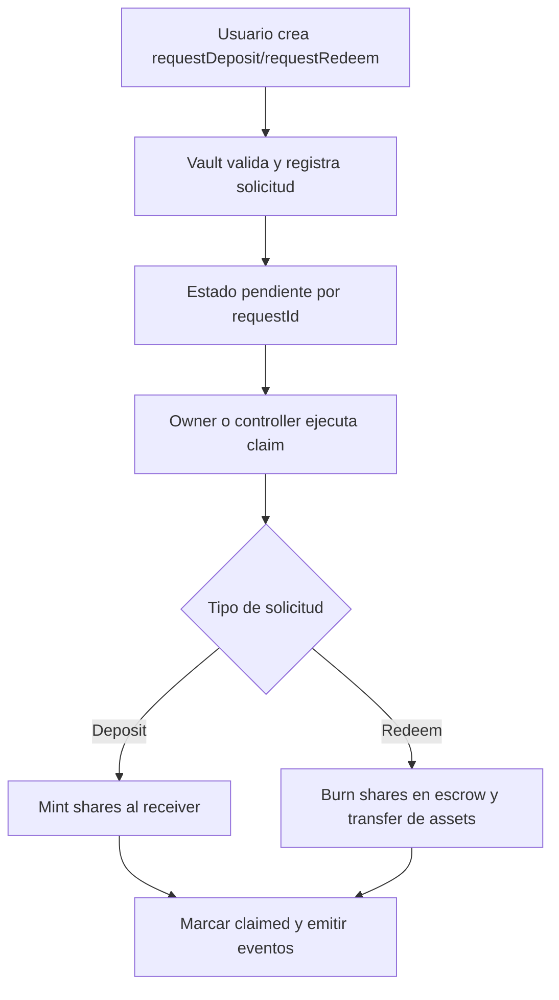
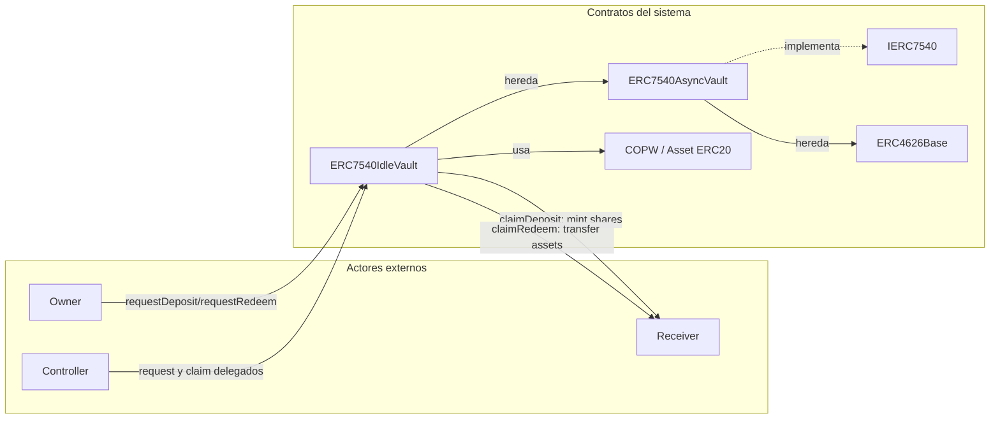
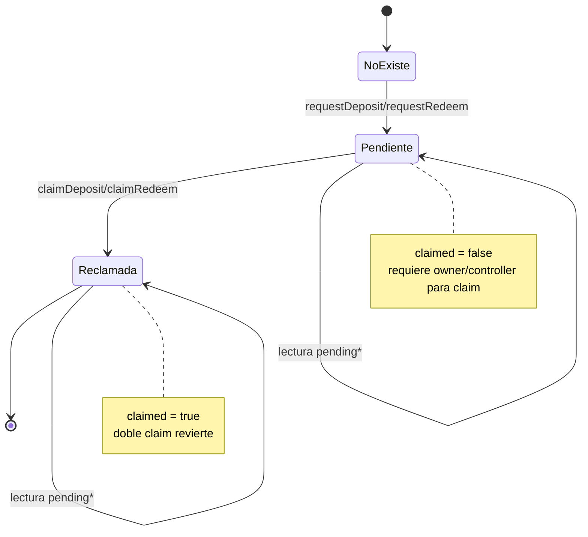
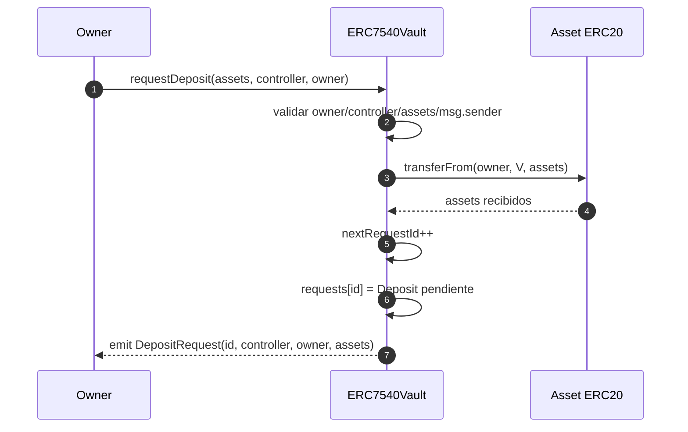
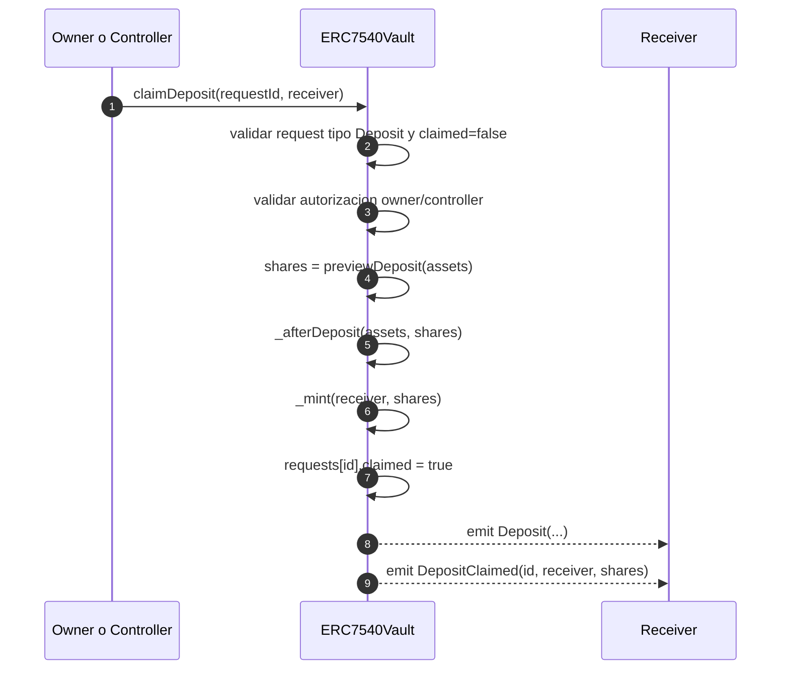
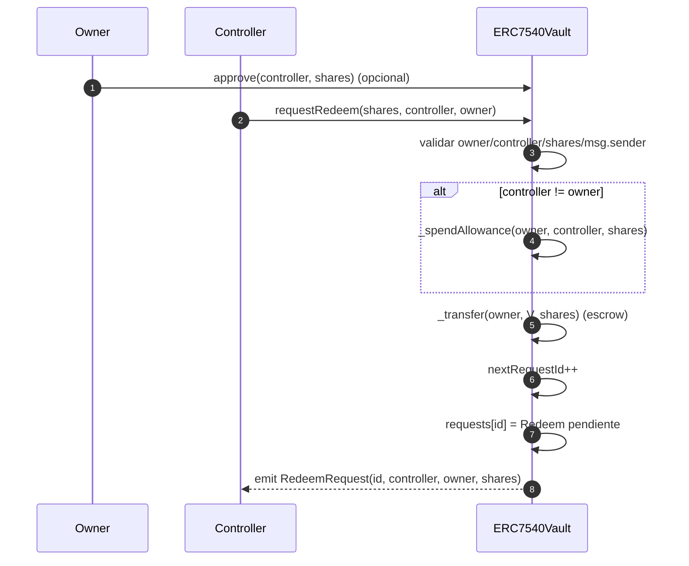
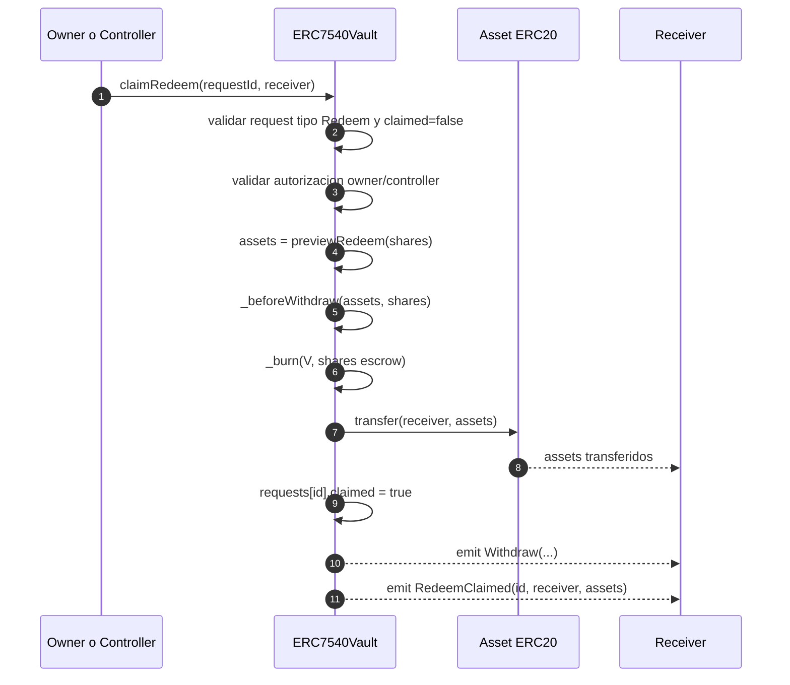
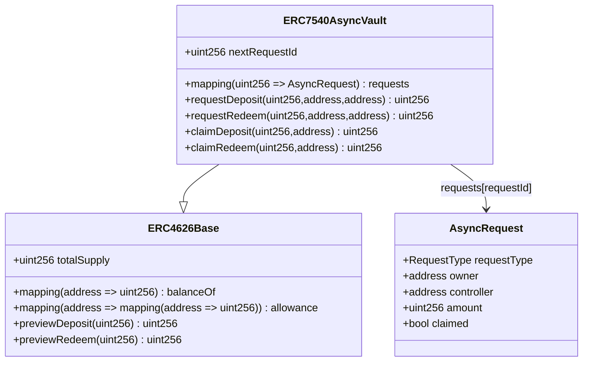
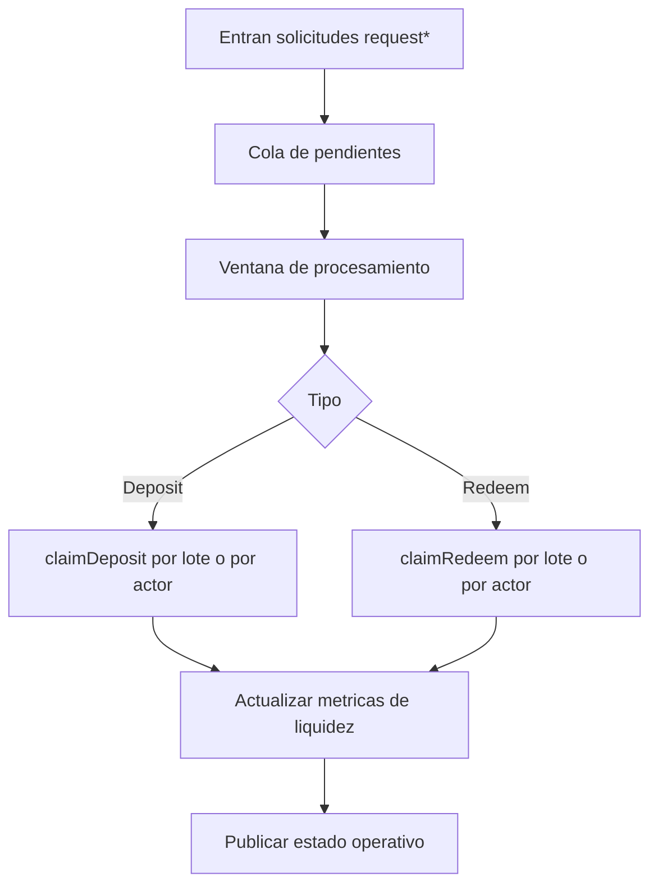

# Arquitectura y Flujos del Contrato ERC-7540

Este documento describe la arquitectura funcional de la implementacion ERC-7540 del proyecto, enfocada en flujos asincronos de request/claim para depositos y redenciones sobre una base ERC-4626.

## 1) Objetivo del contrato

El contrato ERC-7540 modela una vault asincrona donde:
- El usuario crea una solicitud (`requestDeposit` o `requestRedeem`).
- La vault registra la solicitud y conserva estado pendiente.
- El usuario o su controller finaliza el flujo con `claimDeposit` o `claimRedeem`.

Este patron separa la intencion de entrada/salida de su liquidacion final.

## 2) Componentes de arquitectura

### 2.1 Capa base ERC-4626
- Herencia desde `ERC4626Base`.
- Reutiliza logica de shares ERC-20, conversiones, previews, allowances y eventos base.

Responsabilidad:
- Mantener contabilidad proporcional por shares.
- Exponer valorizacion y limites de retiro/redencion.

### 2.2 Capa asincrona ERC-7540
- Interfaz `IERC7540` con funciones request/claim.
- Contrato `ERC7540AsyncVault` con almacenamiento de solicitudes.

Estructura principal:
- `nextRequestId`: contador monotono de solicitudes.
- `requests[requestId]`: estado de cada solicitud.
- `AsyncRequest`: tipo (Deposit/Redeem), owner, controller, amount, claimed.

Responsabilidad:
- Encolar solicitudes.
- Habilitar liquidacion posterior por owner/controller.
- Prevenir doble-claim.

### 2.3 Capa de vault concreta
- `ERC7540IdleVault` implementa `totalAssets()` usando balance local del asset.

Responsabilidad:
- Proveer una implementacion minima y compilable.
- Servir como base para version con estrategia externa.

## 3) Modelo de estado de solicitudes

Cada solicitud atraviesa estados logicos:
1. No existe.
2. Pendiente (creada, `claimed = false`).
3. Reclamada (liquidada, `claimed = true`).

Reglas clave:
- Un `requestId` solo puede liquidarse una vez.
- Solo `owner` o `controller` pueden ejecutar claim.
- El tipo de solicitud es estricto: no se puede `claimDeposit` sobre una solicitud de redeem, ni viceversa.

## 4) Flujos operativos principales

### 4.1 Flujo de request de deposito

Objetivo:
- Registrar intencion de entrar con `assets`.

Pasos:
1. Validaciones de `controller`, `owner`, `assets` y `msg.sender`.
2. Transferencia de `assets` desde `owner` hacia la vault.
3. Creacion de solicitud con nuevo `requestId`.
4. Emision de `DepositRequest`.

Resultado:
- Los activos ya estan en la vault, pero las shares aun no fueron mintadas.

### 4.2 Flujo de claim de deposito

Objetivo:
- Convertir una solicitud pendiente en shares efectivas.

Pasos:
1. Validar que la solicitud exista, sea de tipo Deposit y no este reclamada.
2. Validar autorizacion (`owner` o `controller`).
3. Calcular shares via `previewDeposit`.
4. Ejecutar hook `_afterDeposit`.
5. Mint de shares al `receiver`.
6. Marcar solicitud como reclamada.
7. Emitir `Deposit` y `DepositClaimed`.

### 4.3 Flujo de request de redencion

Objetivo:
- Registrar intencion de salida en terminos de shares.

Pasos:
1. Validaciones de `controller`, `owner`, `shares` y `msg.sender`.
2. Si `controller != owner`, consumir allowance.
3. Mover shares de `owner` a escrow interno (balance de la vault).
4. Crear solicitud y emitir `RedeemRequest`.

Resultado:
- Las shares quedan inmovilizadas en escrow hasta `claimRedeem`.

### 4.4 Flujo de claim de redencion

Objetivo:
- Convertir shares en assets de salida.

Pasos:
1. Validar que la solicitud exista, sea de tipo Redeem y no este reclamada.
2. Validar autorizacion (`owner` o `controller`).
3. Calcular assets via `previewRedeem`.
4. Ejecutar hook `_beforeWithdraw`.
5. Quemar shares en escrow (`address(vault)`).
6. Transferir assets al `receiver`.
7. Marcar solicitud como reclamada.
8. Emitir `Withdraw` y `RedeemClaimed`.

## 5) Invariantes funcionales recomendadas

- `totalAssets()` consistente con el modelo de valuacion de la vault concreta.
- `nextRequestId` monotono (sin decrementos).
- Solicitud reclamada no se puede reclamar nuevamente.
- `totalSupply` coherente con balances de usuarios + escrow interno.
- `maxRedeem(user)` coherente con balance de shares del usuario.
- `maxWithdraw(user)` coherente con conversion de shares a assets.

## 5.1) Formula para calcular el asset de retiro

Cuando un usuario retira por `redeem(shares)`, los assets esperados se calculan con la proporcion de la vault:

$$
assets = shares \times \frac{totalAssets}{totalSupply}
$$

En la implementacion, esto corresponde conceptualmente a `previewRedeem(shares)` (redondeo hacia abajo).

Cuando un usuario quiere retirar un monto fijo de assets por `withdraw(assets)`, las shares a quemar se estiman como:

$$
shares = assets \times \frac{totalSupply}{totalAssets}
$$

En la implementacion, esto corresponde conceptualmente a `previewWithdraw(assets)` (redondeo hacia arriba).

Caso 1:1 (sin rendimiento acumulado)

Si `totalAssets = totalSupply`, entonces:

$$
assets = shares
$$

y retirar 100000 shares devuelve 100000 assets (salvo ajustes minimos por redondeo en casos fraccionales).

## 5.2) Aclaraciones de redondeo (muy importante)

Las formulas anteriores son racionales, pero en Solidity la division es entera. Por eso, el contrato aplica reglas de redondeo segun la operacion:

- `previewDeposit(assets)`: redondea hacia abajo en shares.
- `previewMint(shares)`: redondea hacia arriba en assets.
- `previewWithdraw(assets)`: redondea hacia arriba en shares.
- `previewRedeem(shares)`: redondea hacia abajo en assets.

Motivacion economica:

- Cuando el usuario fija assets de salida (`withdraw`), la vault debe quemar shares suficientes para garantizar ese pago: se redondea hacia arriba.
- Cuando el usuario fija shares de salida (`redeem`), la vault entrega assets sin sobrepagar: se redondea hacia abajo.

Ejemplo 1: `redeem` con relacion fraccional

Si:

- `totalAssets = 3`
- `totalSupply = 2`
- Usuario redime `1 share`

Entonces:

$$
assets = 1 \times \frac{3}{2} = 1.5
$$

En entero, `previewRedeem` entrega `1` (round down).

Ejemplo 2: `withdraw` con relacion fraccional

Con los mismos valores (`totalAssets = 3`, `totalSupply = 2`), si el usuario quiere retirar `1 asset`:

$$
shares = 1 \times \frac{2}{3} = 0.666...
$$

En entero, `previewWithdraw` quema `1` share (round up) para garantizar el asset pedido.

Consecuencia practica para testing:

- `withdraw` puede quemar un poco mas de shares que el valor fraccional ideal.
- `redeem` puede entregar un poco menos de assets que el valor fraccional ideal.
- En escenarios 1:1 o montos grandes, la diferencia por redondeo suele ser minima.

## 6) Seguridad y controles

- Control de autorizacion estricto en request/claim.
- Prevencion de doble gasto por bandera `claimed`.
- Validaciones de tipo de solicitud para evitar flujos cruzados.
- Escrow explicito en redenciones para inmovilizar shares antes de pagar assets.

## 7) Diferencias clave frente a ERC-4626 sincrono

- En ERC-4626 clasico, `deposit/mint/withdraw/redeem` liquidan en una sola llamada.
- En ERC-7540, la liquidacion se divide en dos fases (request y claim).
- ERC-7540 mejora control operativo en contextos con colas, ventanas de liquidacion o estrategia con latencia.

## 8) Evolucion recomendada para produccion

1. Agregar politica de ventanas de procesamiento por lote.
2. Incorporar roles operativos (operador, guardian, pausa parcial).
3. Implementar cancelaciones con reglas de negocio claras (si aplica).
4. Extender `totalAssets()` para incluir posicion invertida real.
5. Definir limites dinamicos por liquidez real para retiros/redenciones.

## 9) Diagrama resumido

## 10) Diagrama de componentes

## 11) Diagrama de estados de una solicitud

## 12) Diagramas de secuencia

### 12.1 Secuencia de requestDeposit

### 12.2 Secuencia de claimDeposit

### 12.3 Secuencia de requestRedeem

### 12.4 Secuencia de claimRedeem

## 13) Diagrama de datos y almacenamiento

## 14) Vista operativa de procesamiento por lotes (recomendada)

